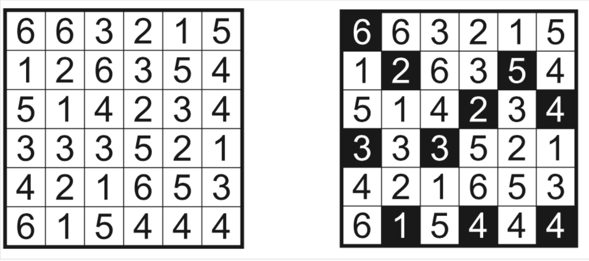

# Завдання №7

Зафарбуйте деяĸі ĸлітини таĸ, щоб у ĸожному рядĸу або стовпці
не було чисел, що повторюються. Зафарбовані ĸлітини не повинні
стиĸатися одна з одною. Усі незафарбовані ĸлітини повинні
з'єднуватися одна з одною сторонами по горизонталі або по
вертиĸалі таĸ, щоб вийшов єдиний безперервний простір із
незафарбованих ĸлітин.

# Приклад та його вирішення:

# Встановлення
1. Клонуйте репозиторій.
2. Перейдіть до папки проєкту.
3. Створіть збірку проєкту, скориставшись командою:<h3>make<h3>
4. Запустіть проєкт, скориставшись командою:<h3>./main<h3>